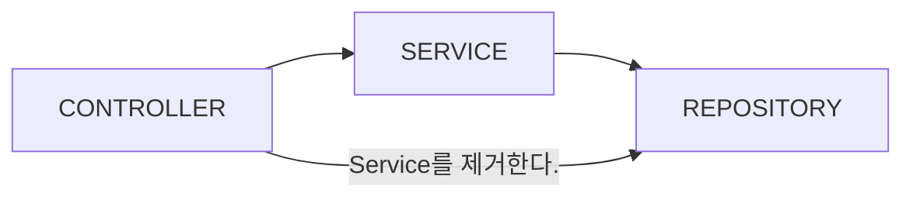

# 🎯 동작 파라미터화2

`Query` 중심의 요구사항을 동작 파라미터화를 통해 해결해보자.  

# ✅ 시작에 앞서

환경은 아래와 같습니다.

- Java: 21
- Launcher JVM:  21.0.5 (Amazon.com Inc. 21.0.5+11-LTS)
- starter-web, starter-data-jpa, QueryDSL, MySQL, Lombok

```shell
$ java -version

> openjdk version "21.0.5" 2024-10-15 LTS
> OpenJDK Runtime Environment Corretto-21.0.5.11.1 (build 21.0.5+11-LTS)
> OpenJDK 64-Bit Server VM Corretto-21.0.5.11.1 (build 21.0.5+11-LTS, mixed mode, sharing)
```

모든 코드는 컴파일 및 런타임에 문제없이 동작합니다. 버전 정보, 환경 설정 등을 확인해주세요.

# 🎯 동작 파라미터화2

웹 아키텍쳐 중 `MVC` 패턴은 가장 널리 알려져 있는 패턴 중 하나이다.
`MVC`에서 `Model` 계층은 크게 `Service`, `Repository` 를 합친 역할을 수행하며,  
흔히 `Controller-Service-Repository` 로 구성한다.  

때론 도메인이 빈약한 모델들이 발견되곤 한다. (도메인을 담기 어렵거나)  
`Service` 계층은 호출만을 담당하고, 영속화의 트랜잭션이든, 어플리케이션의 트랜잭션이든 사실상 기술 구현체 계층에서 풀어낼 수도 있다.  
이러한 계층을 제거하고 `Controller`-`Repository` 패턴으로 다른 아키텍쳐를 그려보자.  

`Controller`의 계층은 클라이언트의 요구 사항에 대한 응답을 최종 반환하는 계층으로 많이 사용된다.  
`RestApi`,`gRPC`,`GraphQL` 등 우리가 알고 있는 `Controller` 계층에서 처리된다.  

`Repository`는 영속화 계층으로 기술 구현체와 연결된다.  
`RDB`, `NoSQL` 등 우리가 알고 있는 `Repository` 그대로 해당된다.  

- `Service` 계층을 제거한다.  



해당 구조는 단순한 `CRUD` 오퍼레이션으로 이루어진 모델에 적합하다. 혹은, `@RepositoryRestController` 를 대체할 수 있다.  

# 🎯 단순한 CRUD 요구사항

`Query`를 작성하는 것이 전부인 프로그램을 볼 수 있는데, `CRUD` 오퍼레이션은 명료, 단순하며 도메인이 빈약한데, 애초에 목적이 그럴 수 있다.  
`Controller` 에서 클라이언트의 오퍼레이션을 정의하고, `Repository` 계층에서 요구사항을 만족시킨다.  

`Port&Adapter` 패턴을 도입해 다음과 같은 아키텍쳐를 가져간다. (전체적인 큰 맥락 이해를 목적으로 간소화하거나 입맛대로 재구성했다.)  

- `adapter`: 기술 구현체를 모아둔다.
- `adapter.input`: 프로그램이 될 수도, 사람이 될 수도 있는 `액터`의 요청이 시작되는 곳이다. (SOLID 의 단일 책임 원칙을 생각하라)
- `adapter.output`: `port`의 구현체이다. 특정 기술을 사용해 도메인의 문제를 풀어주지만, 여기선 `Query` 가 전부일 것이다.
- `infrastructure`: 따로 빼두었지만 사실 `adapter` 계층에 속한다. (JPA 기술)

- `application`: 도메인과 기술 구현체의 중간 단계로 `usecase` 를 명세한다. 이곳에선 도메인과 하나로 퉁쳐서 작성됐다.
- `application.model`: `usecase` 를 달성할 클래스들이다.
- `application.usecase`: 액터와 도메인을 중심으로 `usecase` 를 작성하지만 `Query` 가 전부이다. 
- `application.value`: 값객체들의 집합이다. (`core`, `common` 성격의 클래스도 있지만 무시한다.)

# 🎯 하나의 액터. 오직 `Query` 만

기본값을 주어 동적으로 정렬, 페이징처리, 필터를 적용할 수 있도록 `adapter.input` 계층에서 `@RestController` 를 작성한다.    
- 🔗 [QueryBananaApi](./src/main/java/funtional2/adapter/input/api/QueryBananaApi.java)

## 🎯 PAGEABLE

- ORDER BY
- OFFSET
- LIMIT

정렬 기준과 순서(내림차순,오름차순), 페이지네이션이 적용될 경우 몇 사이즈와 페이지의 위치가 해당된다. `@PageableDefault` 를 정의한다.  

## 🎯 QueryString

필터링 할 목록을 `@RequestParam` 으로 정의하고 `defaultValue` 는 요구 사항에 맞춘다.  
여기까진 자주 사용되는 형태로 `Controller` 계층에 해당된다. 이를 `Repository`에서 추상화해 동적으로 처리해보자.   

## 🎯 Query

`ORM`을 사용하므로 편의상 `Table을 class`로 서술한다.  

쿼리는 아키텍쳐부분에서 가장 저수준에 해당된다.  
질의어 그대로 동작하기에 다형성, 추상화등을 적용할 수 없고 기술 구현체 그 자체(여기서 프레임워크의 추상화는 별개)이기 때문이다.  
쿼리는 보통 `WHERE`, `GROUP BY`, `ORDER BY` 등을 가지고 있으며 어느 부분정도는 동적으로 추상화할 수 있다.  
사실 상위 클래스에서 명시하고 하위 클래스에서 작성하니 크게 다르진 않다.  

이를 추상화하여 `Port`를 끼우듯 `CRUD`를 풀어보자.  

## 🎯 QueryBase

- 🔗 [QueryBase](./src/main/java/funtional2/application/model/QueryBase.java)

`Query`를 날릴 때 기본적으로 들어가는 모든 필수 값을 상위 클래스에 추상화해서 정의해두고 하위 타입에선 이를 구현한다.  
`QueryDSL`과 `spring-data-jpa` 스펙을 사용할 수 있도록 해당 클래스에서 [공변성](../generic/README.md) 과 함께 정의한다.  

## 🎯 QueryUseCase

`Controller` 계층에서 호출할 때 사용할 [DSL](../custom-dsl/README.md)이다.  
여러개의 결과값을 매개변수로 넘겨줄 수 있도록 구현되어 있다.  

- 🔗 [QueryUseCase](./src/main/java/funtional2/application/usecase/QueryUseCase.java)

## 🎯 Port

`QueryBase` 의 실제 구현체들이다.  

- 🔗 [Port](./src/main/java/funtional2/adapter/output/port/QueryApplePort.java)

## 🎯 QueryParamConditions

클라이언트의 `Request`, `Response` 의 값객체들.

- 🔗 [QueryParamConditions](./src/main/java/funtional2/application/value/QueryParamConditions.java)
- 🔗 [ParamCondition](./src/main/java/funtional2/application/value/ParamCondition.java)
- 🔗 [QueryResult](./src/main/java/funtional2/application/value/QueryResult.java)

일급 콜렉션으로 구현한다.  

- 🔗 [QueryPortList](./src/main/java/funtional2/application/value/QueryPortList.java)
- 🔗 [ValidAuthorityPortList](./src/main/java/funtional2/application/value/ValidAuthorityPortList.java)

## 🎯 ORDER BY

클라이언트의 정렬 기준을 적용하기 위한 `OrderSpecifier` 구현을 담당하는 [QueryDslUtil](./src/main/java/funtional2/application/model/QueryDslUtil.java) 클래스를 정의한다.  
함수형 인터페이스를 매개변수로 받아, 실제 Port 에서는 간결하게 구현할 수 있다. ([Port](./src/main/java/funtional2/adapter/output/port/QueryApplePort.java) 의 오버로딩된 `createEntityPath()` 메서드)

QueryDSL 에서는 SQL/HQL 인젝션 공격 문제(🔗 [ISSUES](https://github.com/querydsl/querydsl/issues/3757))가 발생할 수 있는데, [QueryDslUtil](./src/main/java/funtional2/application/model/QueryDslUtil.java) 의 클래스로 해결할 수 있다.

## 🚀 Exam Api

Port 들의 응집도를 높일 수 있고 여러 곳에서 사용할 수 있다. 보통 `JOIN` 등을 통한 쿼리는 Port 수준으로 해결하기 어렵지만,  
설계단계에서 충분히 응집력이 높은 `JOIN` 의 결과를 가지고 있는 Port 를 추출할 수 있다.  
[QueryBananaApi](./src/main/java/funtional2/adapter/input/api/QueryBananaApi.java) 를 확인하면 리스트와 단일 데이터의 결과를 받도록 구현되었다.  

만약, 추가 요구 사항으로 전체 과일 목록이 필요한 경우에 두 개의 테이블(Class)을 담당하는 Port 들을 호출하여 추가하기만 하면 된다.  
[QueryFruitApi](./src/main/java/funtional2/adapter/input/api/QueryFruitApi.java) 를 확인하면 리스트와 단일 데이터의 결과를 받도록 구현되었다.  

QueryString 으로 동적 요청에 대해 잘 응답하는 것을 확인할 수 있으며 필요에 따라 `port` 에서  `Projection` 관련 클래스를 적용할 수 있다.  
위와 같이 요구 사항에 대해 이런 방식으로도 풀어낼 수 있지만, 동작 파라미터화를 잘 응용하면 더 좋은 코드를 작성할 수 있게 된다.  